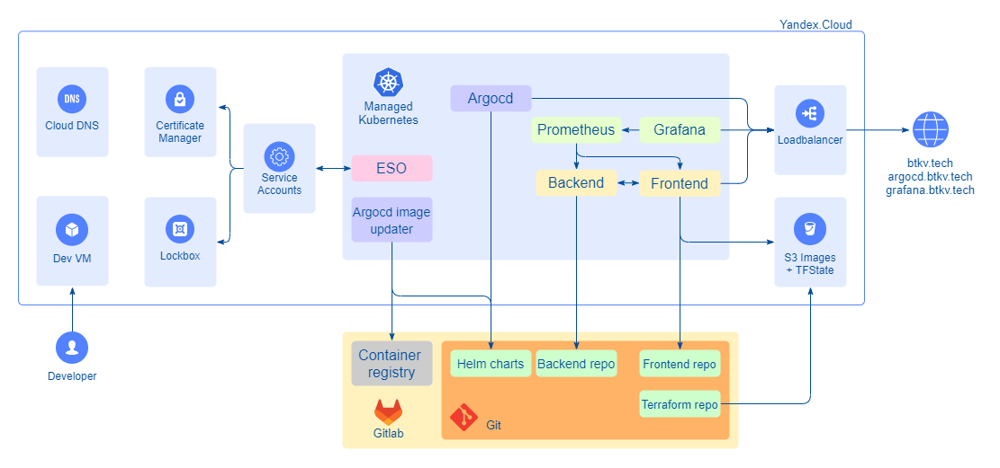
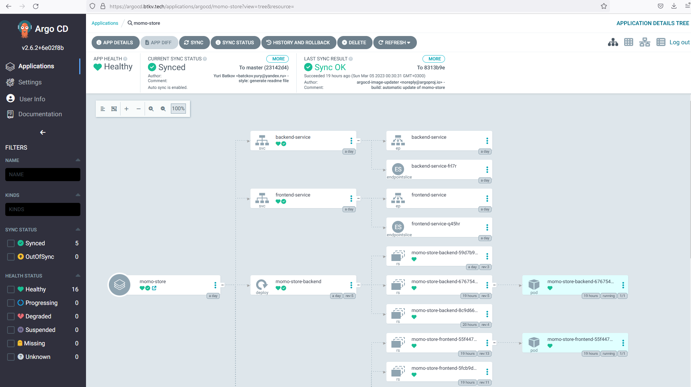
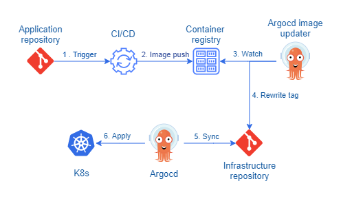
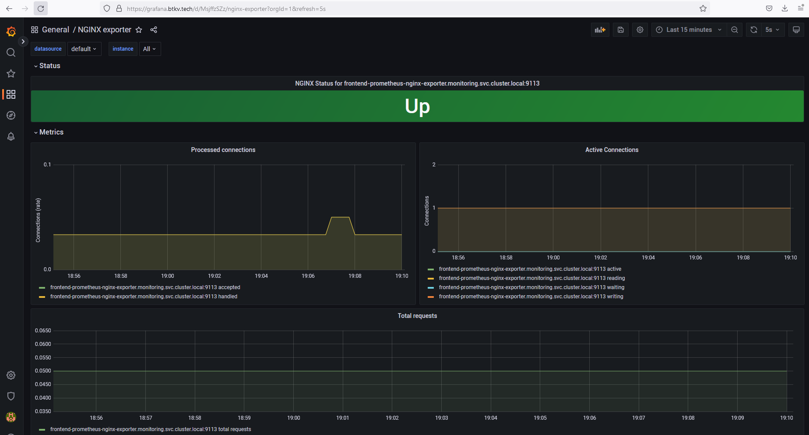

## About The Project

This repository was developed to provide examples of how to build and support Gitops process based on Argocd.



See additional instructions and readme files for **application** in [https://gitlab.praktikum-services.ru/std-009-060/momo-store](https://gitlab.praktikum-services.ru/std-009-060/momo-store) repository.

# Getting Started

Repository structure:
```
├── helm-charts
│   ├── momo-store - main chart for Momo app
├── helm-manifests-argocd - to bootstrap argocd
├── helm-manifests-argocd-image-updater - to bootstrap argocd-image-updater
├── helm-manifests-eso - to bootstrap external secret operator
├── helm-manifests-monitoring - to bootstrap prometheus and grafana
├── Kubernetes
│   ├── backend - not in use
│   ├── frontend - not in use
│   ├── init - to get static configuration file
├── Terraform - to bootstrap infra environmet on Yandex.Cloud
    ├── Compute
    ├── DNSCert
    ├── k8s
    ├── Lockbox
    ├── S3-store
    ├── S3-tfstate
    ├── ServiceAccount
    ├── VPC
```

## Installation Instructions

These instructions demonstrate how to deploy Momo Store infrastructure into managed k8s cluster on Yandex.Cloud.

### Pre-requisites

1. Yandex Cloud command line interface - [yc cli](https://cloud.yandex.com/en/docs/cli/quickstart#install)
1. Terraform command line interface - [terraform cli](https://cloud.yandex.com/en/docs/tutorials/infrastructure-management/terraform-quickstart)

The rest tools will be installed automatically (by cloud-config) on dev VM server.

### Prepare Yandex.Cloud environment (Terraform)

1. Deploy network objects (VPC, Subnets, SG, etc ) - Terraform\VPC
1. Deploy S3 bucket (to store terraform states) - Terraform\S3-tfstate
1. Deploy dev VM (based on Ubuntu 22.04), optional - Terraform\Compute
1. Deploy k8s cluster - Terraform\k8s
1. Deploy service accounts - Terraform\ServiceAccount
1. Deploy S3 bucket (to store static images) - Terraform\ServiceAccount
1. Deploy DNS zone and request Let's Encrypt certificate - Terraform\DNSCert
1. Deploy Lockbox - Terraform\Lockbox

## Get kubeconfig file

See [README](https://gitlab.praktikum-services.ru/std-009-060/momo-infra/-/blob/master/Kubernetes/init/README.md) for detailed instructions.

## Deploy and configure External Secret Operator

The goal of External Secrets Operator is to synchronize secrets from Yandex.Lockbox into Kubernetes.
We will sync:
- dockerconfigjson file to access container registry
- secret with username, url and token from app repository
- secret with username, url and token from infrastructure repository
- secret with TLS certificate and private key

All these secrets will be installed to appropriate k8s namespace.

See [README](https://gitlab.praktikum-services.ru/std-009-060/momo-infra/-/blob/master/helm-manifests-eso/README.md) for detailed instructions.

## Deploy and configure Argocd

Argo CD follows the GitOps pattern of using Git repositories as the source of truth for defining the desired application state. It track updates to main branch of infra repository (helm-charts/momo-store) using **git** generator of [ApplicationSet](https://argo-cd.readthedocs.io/en/stable/user-guide/application-set/).



See [README](https://gitlab.praktikum-services.ru/std-009-060/momo-infra/-/blob/master/helm-manifests-argocd/README.md) for detailed instructions.

## Deploy and configure Argocd-image-updater

The Argo CD Image Updater checks for new versions of the container images (both frontend and backend) that are deployed with your Kubernetes workloads and automatically update them to their latest allowed version using Argo CD.



See [README](https://gitlab.praktikum-services.ru/std-009-060/momo-infra/-/blob/master/helm-manifests-argocd-image-updater/README.md) for detailed instructions.

## Deploy and configure Prometheus and Grafana

Prometheus is an open source monitoring system for which Grafana provides out-of-the-box support.



See [README](https://gitlab.praktikum-services.ru/std-009-060/momo-infra/-/blob/master/helm-manifests-monitoring/README.md) for detailed instructions.

# Contributing

Any contributions you make are **greatly appreciated**.

If you have a suggestion that would make this better, please fork the repo and create a merge request. You can also simply open an issue with the tag "enhancement".

1. Fork the Project
2. Create your Feature Branch (`git checkout -b feature/AmazingFeature`)
3. Commit your Changes (`git commit -m 'Add some AmazingFeature'`)
4. Push to the Branch (`git push origin feature/AmazingFeature`)
5. Open a Merge Request

# Contact

Yuriy Batkov - yb@btkv.tech

Project Link: [https://gitlab.praktikum-services.ru/std-009-060/momo-infra](https://gitlab.praktikum-services.ru/std-009-060/momo-infra)